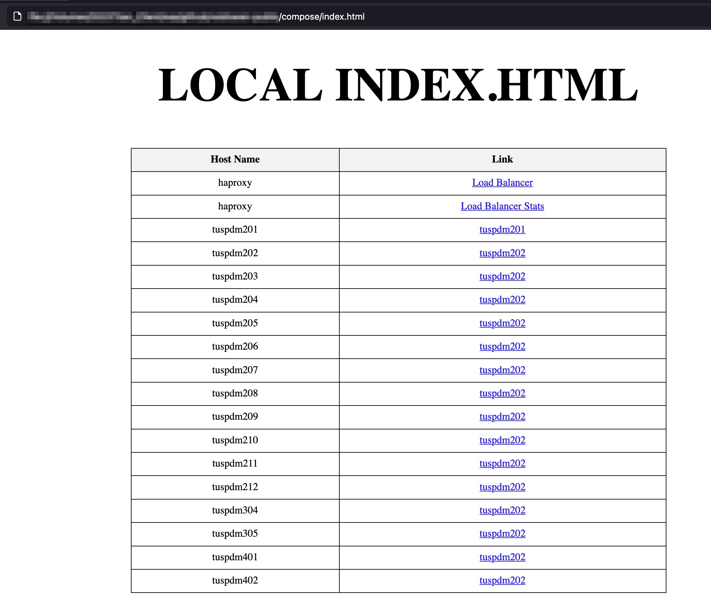
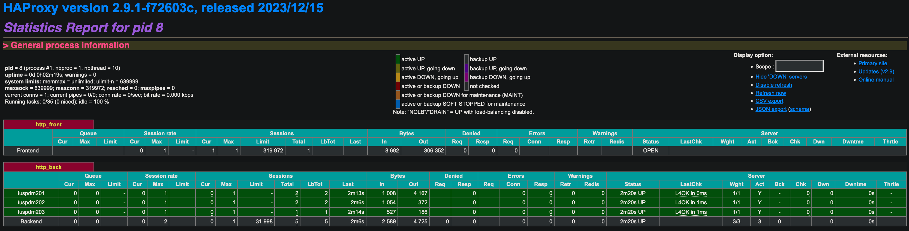

# Prerequisites

1. Install Docker for Mac Silicon using these instructions:

https://docs.docker.com/desktop/install/mac-install/

2. Install Docker Compose For Mac Silicon using these instructions.

https://docs.docker.com/compose/install/linux/#install-the-plugin-manually

# Getting Started

1. Launch the containers.

`docker-compose up -d`

2. Open the `index.html` file in this folder in your web browser.



3. Open http://localhost:8100.  This is the load balancer which sends the connection to one of 3 servers (tuspdm201, tuspdm202 or tuspdm203.)  The load balancer randomly picks one of the servers.

4. View the load balancer stats here http://localhost:8100/stats.



# Test Scenarios

```
# list all docker containers
docker ps | grep tuspdm

---
CONTAINER	ID		
d9b3a70ef934	httpd:latest	compose-tuspdm202-1	
6b598bbd258d	httpd:latest	compose-tuspdm210-1	
d991b1cd87da	httpd:latest	compose-tuspdm401-1	
7951ca2b7c43	httpd:latest	compose-tuspdm204-1	
ae670cdaed5b	httpd:latest	compose-tuspdm207-1	
aaf9351b234a	httpd:latest	compose-tuspdm206-1	
9eb0ca538615	httpd:latest	compose-tuspdm205-1	
440ee8d8a3bc	httpd:latest	compose-tuspdm203-1	
640315bc15e3	httpd:latest	compose-tuspdm304-1	
3b570c923fa3	httpd:latest	compose-tuspdm208-1	
ac7648b2cb04	httpd:latest	compose-tuspdm211-1	
654ce4978a06	httpd:latest	compose-tuspdm209-1	
465a0a7e94e3	httpd:latest	compose-tuspdm201-1	
62e823289476	httpd:latest	compose-tuspdm212-1	
5b8137a96e9c	httpd:latest	compose-tuspdm305-1	
eff4a75eddd5	httpd:latest	compose-tuspdm402-1	
---

# open a terminal session in the container for tuspdm201
docker exec -it compose-tuspdm202-1 bash

# install ping utility in the tspdm201 container
apt update -y
apt install -y iputils-ping

# ping another container
ping 172.21.84.109
```